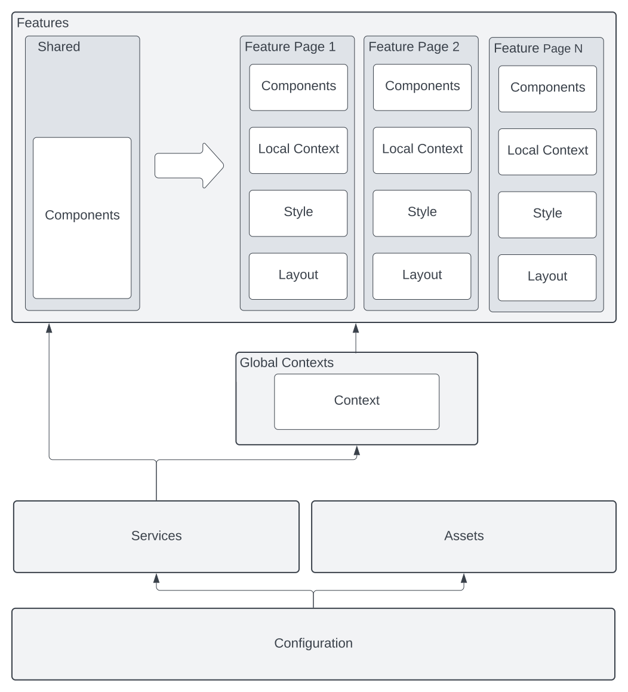

# INMET Browser

## On Boarding

- Configuração do ambiente de desenvolvimento
    - Variáveis ambientais
    - Git hooks 'standard' => Adicionar instruções de instalação
    - Formato de commits: [conventionalcommits](https://www.conventionalcommits.org/en/v1.0.0/#summary)

- Ferramentas
    - 

- Arquitetura

    - Exemplos
        - Nova página => Elaborar etapas necessárias para criação de uma nova pagina/feature
        - Novo componente => ^^^^
    - Onde colocar as coisas
    - Diagrama da arquitetura https://lucid.app/
    - Arvore de pastas

## Design System

https://www.patternfly.org/v4/

Blues          https://coolors.co/c3e7f6-9be2f3-5bc5f2-1cadeb-0977b2-054b70-042f47-02151f
Cyans          https://coolors.co/effbfa-9be5d9-62d7c3-00987e-006556-003d33-002822-001412

Personalizando o Patternfly

https://www.patternfly.org/v4/developer-resources/global-css-variables
